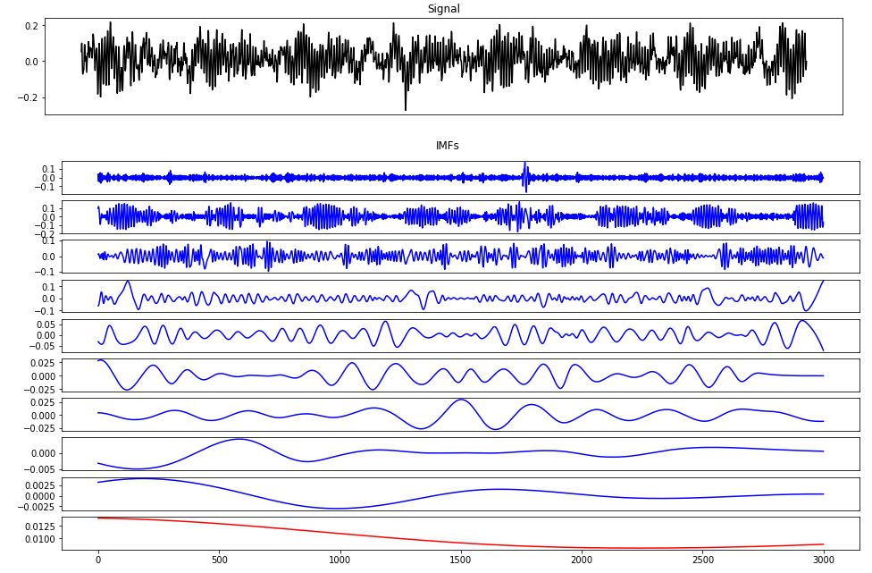
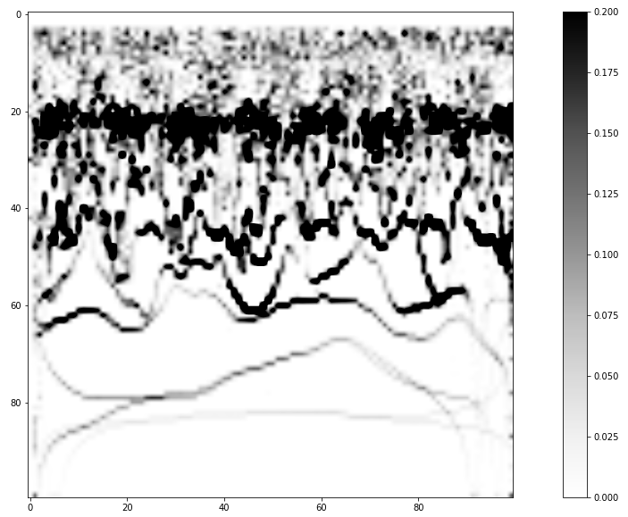
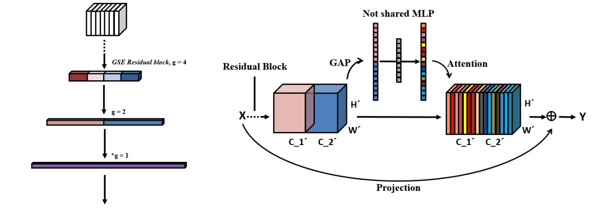
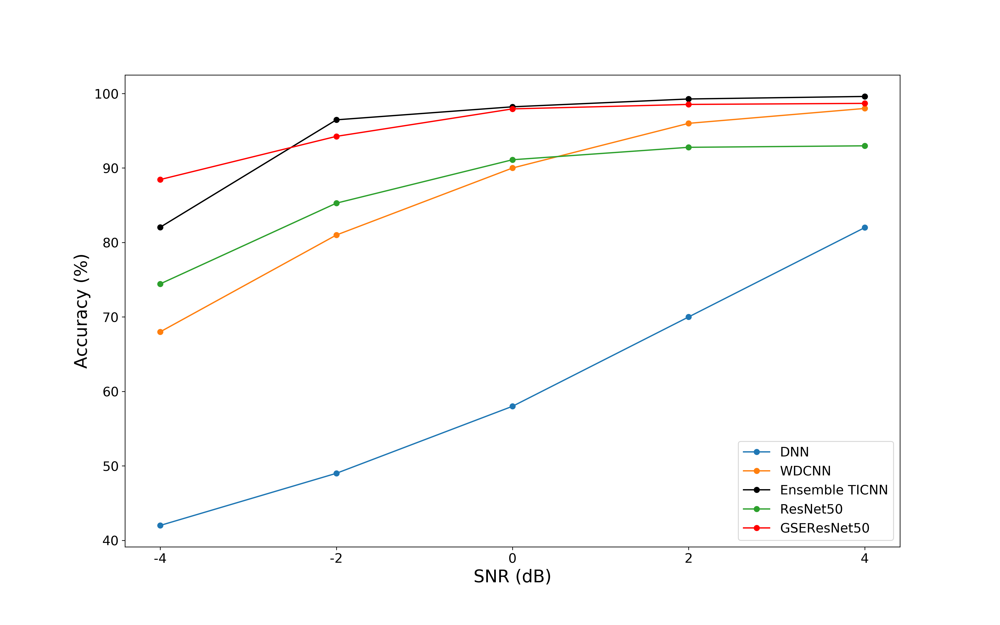

# Grouped_Convolution-Based_Bearing_Fault_Detection

## Hilbert Huang Transform

### Intrinsic Mode Functions (IMFs) by Empirical Mode Decomposition (EMD)

### Hilbert Spectral Analysis

## Gradual Grouped Convolution and Following Channel Attention

## Result

